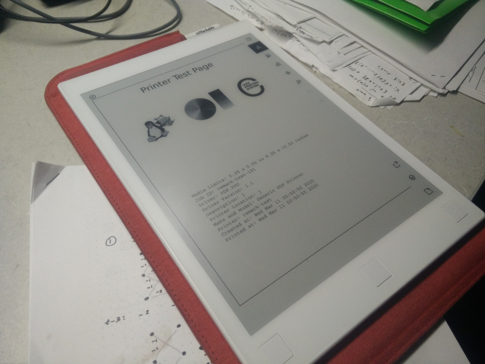

# remarkable_printer

Print natively to your reMarkable wirelessly with no extensions or reMarkable cloud.

## Quick Start

Connect the reMarkable via USB and make sure it has internet access.

Connect to the reMarkable with [SSH](https://remarkablewiki.com/tech/ssh) and execute

    wget -O - http://raw.githubusercontent.com/Evidlo/remarkable_printer/master/install.sh | sh
    
Then configure your OS to print to the reMarkable, shown below.
    
## Adding the reMarkable as a printer

#### Linux/OSX (easy)

    make install_config host=10.11.99.1

#### Linux (manual)

We will add the reMarkable as an Appsocket/JetDirect printer and use the PDF printer driver.

Linux

    $ sudo system-config-printer
    # Add > Network Printer > AppSocket/HP JetDirect
    # Enter the address/hostname of the device (10.11.99.1 for USB connected device)
    # Forward > Generic > Forward > PDF > Forward
    # Set the printer name and save
    
#### OSX (manual)

See [Add a network printer by its IP address](https://support.apple.com/guide/mac-help/add-a-printer-on-mac-mh14004/mac).  Choose `HP Jetdirect` for the protocol.

#### Windows (manual)

See [here](https://github.com/Evidlo/remarkable_printer/wiki/Windows-Setup)

#### Caveats

No authentication, so keep WiFi off while not in use.

## How it works

Virtually all network printers accept raw Postscript/PDF data on TCP port 9100 via the Appsocket/HP Jetdirect protocol.  Sometimes this data is preceded by a few plaintext lines telling the printer information such as the print job name and print settings.

This script simply listens on TCP 9100 and waits for a PDF header, then begins saving data to a pdf file (while also creating the accompanying .metadata file).  The output filename is extracted from the print job name line, if it exists.

## Testing on host

    $ make printer.x86
    $ ./printer.x86 -h
    Usage of ./printer.x86:
      -debug
            enable debug output
      -host string
            override bind address (default "0.0.0.0")
      -port string
            override bind port (default "9100")
      -restart
            restart xochitl after saving PDF
      -test
            use /tmp as output dir

## Debugging

    journalctl --unit printer -f
